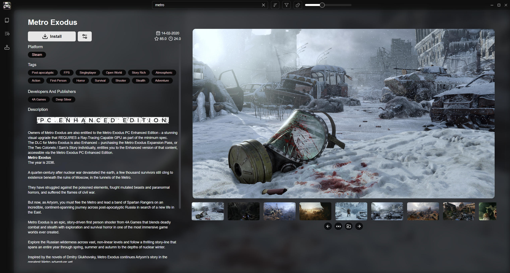

  
  <strong style="font-size: 24px;">quicksave</strong>

  <em>A free and open source video game library and screenshot manager.</em>

  
  &nbsp;&nbsp;&nbsp;
  

## Important

- This project is still in beta — you may encounter bugs.
- Make sure to use the **backup feature** to preserve user data.
- As of right now only windows is supported, Linux support soon.

## Features

- External Library Integration – Import your libraries from Steam and PlayStation
- Playtime Tracker – Tracks playtime for all your games
- Game Launcher – View all installed games and launch them directly from the app
- Metadata Fetching – Uses IGDB to fetch game metadata and cover art
- Screenshots – Take in-game screenshots and view them in the app
- Themes – Customize the look of the app to your liking

## Planned Features

- More integrations: Xbox, Epic, GOG, Playnite, Ubisoft Connect
- Video Game OST integration
- Trophy / Achievements integration
- DLC integration

## API Keys

Your API keys are **never exposed** or stored insecurely.

- **[Steam API key](https://steamcommunity.com/discussions/forum/1/3047235828269633221/)** – Required to fetch your Steam library (needs your Steam ID and API key).
- **PlayStation Support** – Log in at [PlayStation Homepage](https://www.playstation.com/), then visit [this page](https://ca.account.sony.com/api/v1/ssocookie) to get your **NPSSO code**.
